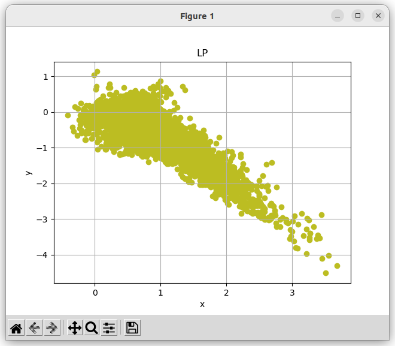
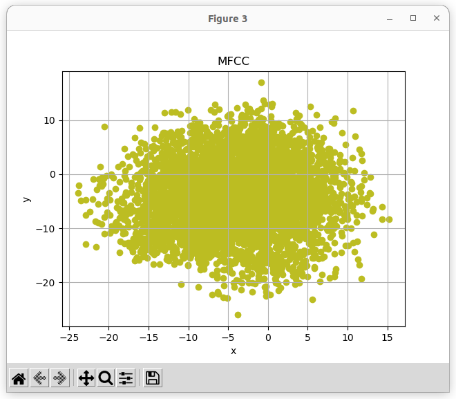
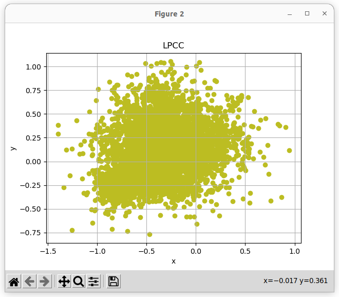
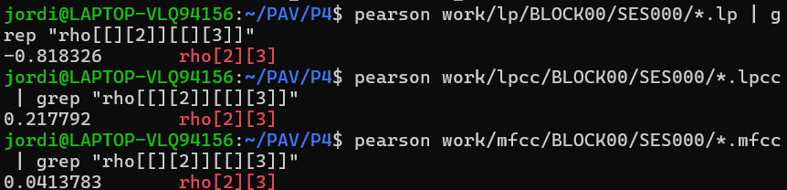

PAV - P4: reconocimiento y verificación del locutor
===================================================

Obtenga su copia del repositorio de la práctica accediendo a [Práctica 4](https://github.com/albino-pav/P4)
y pulsando sobre el botón `Fork` situado en la esquina superior derecha. A continuación, siga las
instrucciones de la [Práctica 2](https://github.com/albino-pav/P2) para crear una rama con el apellido de
los integrantes del grupo de prácticas, dar de alta al resto de integrantes como colaboradores del proyecto
y crear la copias locales del repositorio.

También debe descomprimir, en el directorio `PAV/P4`, el fichero [db_8mu.tgz](https://atenea.upc.edu/mod/resource/view.php?id=3654387?forcedownload=1)
con la base de datos oral que se utilizará en la parte experimental de la práctica.

Como entrega deberá realizar un *pull request* con el contenido de su copia del repositorio. Recuerde
que los ficheros entregados deberán estar en condiciones de ser ejecutados con sólo ejecutar:

~~~~~~~~~~~~~~~~~~~~~~~~~~~~~~~~~~~~~~~~~~~~~~~~~~~~~.sh
  make release
  run_spkid mfcc train test classerr verify verifyerr
~~~~~~~~~~~~~~~~~~~~~~~~~~~~~~~~~~~~~~~~~~~~~~~~~~~~~

Recuerde que, además de los trabajos indicados en esta parte básica, también deberá realizar un proyecto
de ampliación, del cual deberá subir una memoria explicativa a Atenea y los ficheros correspondientes al
repositorio de la práctica.

A modo de memoria de la parte básica, complete, en este mismo documento y usando el formato *markdown*, los
ejercicios indicados.

## Ejercicios.

### SPTK, Sox y los scripts de extracción de características.

- Analice el script `wav2lp.sh` y explique la misión de los distintos comandos involucrados en el *pipeline*
  principal (`sox`, `$X2X`, `$FRAME`, `$WINDOW` y `$LPC`). Explique el significado de cada una de las 
  opciones empleadas y de sus valores.

Este script sirve para sacar características LPC (Linear Predictive Coding) de un archivo de audio en formato WAV. 

#### **Comando `sox`**
- **Qué hace**: Convierte el archivo WAV en datos sin procesar (`raw`) para que otras herramientas puedan trabajar con ellos.
- **Opciones**:
  - `-t raw`: Dice que la salida debe ser en formato crudo.
  - `-e signed`: Especifica que los datos tienen signo (pueden ser positivos o negativos).
  - `-b 16`: Cada muestra ocupa 16 bits.
- **Entrada**: El archivo de audio original.
- **Salida**: Una versión cruda de los datos del audio.

#### **Comando `$X2X`**
- **Qué hace**: Cambia el formato de los datos del audio de enteros a números en coma flotante, que son más fáciles de manejar para los cálculos.
- **Opciones**:
  - `+sf`: Convierte datos de enteros de 16 bits a números flotantes.
- **Entrada**: Los datos crudos del audio.
- **Salida**: Datos en coma flotante.

#### **Comando `$FRAME`**
- **Qué hace**: Divide el audio en trozos pequeños llamados "tramas", con solapamiento entre ellos para que no se pierda información.
- **Opciones**:
  - `-l 240`: Cada trama tiene 240 muestras.
  - `-p 80`: Las tramas se solapan 80 muestras.
- **Entrada**: Los datos en coma flotante.
- **Salida**: Tramas del audio.

#### **Comando `$WINDOW`**
- **Qué hace**: Aplica una ventana a cada trama para evitar problemas en los bordes al hacer cálculos.
- **Opciones**:
  - `-l 240`: Longitud de la ventana.
  - `-L 240`: Longitud de los datos dentro de la ventana.
- **Entrada**: Las tramas del audio.
- **Salida**: Tramas procesadas con una ventana.

#### **Comando `$LPC`**
- **Qué hace**: Calcula los coeficientes LPC (básicamente, unos números que representan cómo suena el audio).
- **Opciones**:
  - `-l 240`: Longitud de la trama.
  - `-m $lpc_order`: Orden del análisis LPC, que se define al principio del script.
- **Entrada**: Las tramas con ventana.
- **Salida**: Archivo con los coeficientes LPC de cada trama.

- Explique el procedimiento seguido para obtener un fichero de formato *fmatrix* a partir de los ficheros de
  salida de SPTK (líneas 49 a 55 del script `wav2lp.sh`).

  El formato `fmatrix` tiene un encabezado con el número de filas (`nrow`) y columnas (`ncol`), seguido de los datos LPC. 

1. **Cálculo de las dimensiones**:
   - `ncol`: Es el orden LPC más uno (porque también incluye el coeficiente de ganancia).
   - `nrow`: Se obtiene dividiendo el total de valores LPC entre el número de columnas (`ncol`).

2. **Escritura del encabezado**:
   - Primero se escriben `nrow` y `ncol` en el archivo usando `$X2X +aI`.

3. **Añadir los datos**:
   - Luego se mete todo el contenido del archivo temporal `$base.lp` al final.

  * ¿Por qué es más conveniente el formato *fmatrix* que el SPTK?

- **Más organizado**: El formato `fmatrix` tiene un encabezado que dice cuántas filas y columnas hay, así que no necesitas calcularlo después.
- **Más compatible**: Es más fácil de usar en otros programas y herramientas.
- **Más práctico**: Todo está bien ordenado y listo para usar, sin tener que hacer más cálculos ni conversiones.

- Escriba el *pipeline* principal usado para calcular los coeficientes cepstrales de predicción lineal
  (LPCC) en su fichero <code>scripts/wav2lpcc.sh</code>:

<code>
sox $inputfile -t raw -e signed -b 16 - | $X2X +sf | $FRAME -l 240 -p 80 | $WINDOW -l 240 -L 240 |
  $LPC -l 240 -m $lpc_order | $LPCC -m $lpc_order -M $lpcc_order > $base.lpcc || exit 1
</code>

- Escriba el *pipeline* principal usado para calcular los coeficientes cepstrales en escala Mel (MFCC) en su
  fichero <code>scripts/wav2mfcc.sh</code>:

<code>
sox $inputfile -t raw -e signed -b 16 - | $X2X +sf | $FRAME -l 240 -p 80 | $WINDOW -l 240 -L 240 |
    $MFCC -w 1 -s 8 -l 240 -m $mfcc_order -n $mfcc_banks > $base.mfcc || exit 1
</code>

### Extracción de características.

- Inserte una imagen mostrando la dependencia entre los coeficientes 2 y 3 de las tres parametrizaciones
  para todas las señales de un locutor.
  

  + Indique **todas** las órdenes necesarias para obtener las gráficas a partir de las señales 
    parametrizadas.
    Despues se manda a llamar nuestro codigo <code>coeficients.py</code> desde linea de comandos para poder visualizar las graficas.
    
    
    

  + ¿Cuál de ellas le parece que contiene más información?

Se observa que los coeficientes 2 y 3 de LP están alineados, indicando una fuerte dependencia lineal entre ellos y una menor cantidad de información. Por el contrario, en LPCC los puntos presentan una distribución mucho más dispersa, lo que sugiere una mayor incorrelación entre los coeficientes y una mayor diversidad en los datos. De manera similar, en MFCC la distribución también es dispersa, pero más uniforme, reflejando una baja correlación y una información más organizada. 

Así, tanto LPCC como MFCC contienen más información que LP debido a la menor redundancia entre sus coeficientes, lo que las convierte en opciones más útiles para análisis donde se busca maximizar la diversidad de las características.

- Usando el programa <code>pearson</code>, obtenga los coeficientes de correlación normalizada entre los
  parámetros 2 y 3 para un locutor, y rellene la tabla siguiente con los valores obtenidos.

  

  |                        | LP   | LPCC | MFCC |
  |------------------------|:----:|:----:|:----:|
  | &rho;x[2,3] |-0.8183|0.2177|0.04137|
  
  + Compare los resultados de <code>pearson</code> con los obtenidos gráficamente.
  
- Según la teoría, ¿qué parámetros considera adecuados para el cálculo de los coeficientes LPCC y MFCC?

Para **MFCC**:
- **Ventanas** de 20 a 40 ms.
- **Frecuencia de muestreo** típica de 8 kHz.
- Un **banco de filtros Mel** de entre 20 y 40 filtros, para equilibrar la resolución espectral y el coste computacional.
- Los primeros **13 coeficientes cepstrales** son los más comunes, aunque también pueden considerarse hasta 20 coeficientes, dependiendo de la aplicación.
- Se aplica la **Transformada Discreta del Coseno (DCT)** para compactar la energía espectral y reducir la redundancia.

Para **LPCC**:
- Un **orden** de 10 a 16 para el modelo de predicción lineal (LPC).
- **Frecuencia de muestreo** similar a la de MFCC, alrededor de 8 kHz.
- **Ventanas** de 20 a 40 ms.
- Se seleccionan entre **12 y 16 coeficientes cepstrales**.
- Se aplica **suavizado cepstral** para evitar fluctuaciones abruptas en los coeficientes.

### Entrenamiento y visualización de los GMM.

Complete el código necesario para entrenar modelos GMM.

- Inserte una gráfica que muestre la función de densidad de probabilidad modelada por el GMM de un locutor
  para sus dos primeros coeficientes de MFCC.

- Inserte una gráfica que permita comparar los modelos y poblaciones de dos locutores distintos (la gŕafica
  de la página 20 del enunciado puede servirle de referencia del resultado deseado). Analice la capacidad
  del modelado GMM para diferenciar las señales de uno y otro.

### Reconocimiento del locutor.

Complete el código necesario para realizar reconociminto del locutor y optimice sus parámetros.

- Inserte una tabla con la tasa de error obtenida en el reconocimiento de los locutores de la base de datos
  SPEECON usando su mejor sistema de reconocimiento para los parámetros LP, LPCC y MFCC.

### Verificación del locutor.

Complete el código necesario para realizar verificación del locutor y optimice sus parámetros.

- Inserte una tabla con el *score* obtenido con su mejor sistema de verificación del locutor en la tarea
  de verificación de SPEECON. La tabla debe incluir el umbral óptimo, el número de falsas alarmas y de
  pérdidas, y el score obtenido usando la parametrización que mejor resultado le hubiera dado en la tarea
  de reconocimiento.
 
### Test final

- Adjunte, en el repositorio de la práctica, los ficheros `class_test.log` y `verif_test.log` 
  correspondientes a la evaluación *ciega* final.

### Trabajo de ampliación.

- Recuerde enviar a Atenea un fichero en formato zip o tgz con la memoria (en formato PDF) con el trabajo 
  realizado como ampliación, así como los ficheros `class_ampl.log` y/o `verif_ampl.log`, obtenidos como 
  resultado del mismo.
